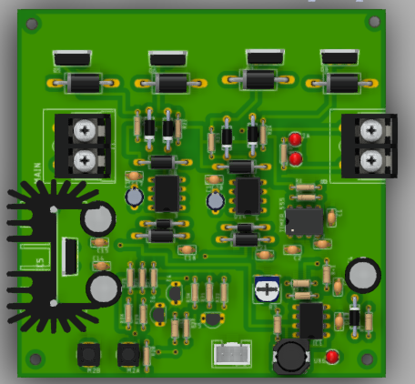
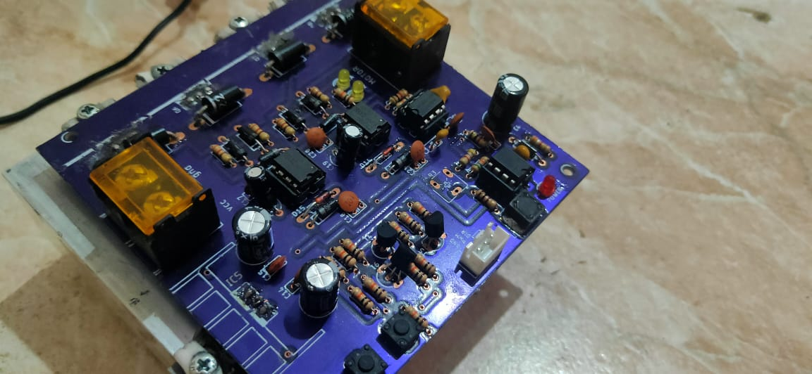

# PCB Design and Fabrication Portfolio
This portfolio showcases my previous work in PCB design and fabrication. It includes pictures of various PCBs that I have designed and fabricated using Eagle PCB tool.

## Overview
I am a junior embedded systems engineer with experience in designing and fabricating PCBs using Eagle CAD. I have designed and fabricated numerous PCBs for various applications, including microcontroller circuits, motor drivers, and power supplies.

## Projects
This portfolio includes pictures of the following PCBs that I have designed and fabricated:

- Microcontroller circuit
- Motor driver circuit
- Power supply circuit
- And more!

## Skills
My skills in PCB design and fabrication include:

- Designing and routing PCBs using Eagle CAD
- Knowledge of PCB layout design principles
- Creating custom footprints for components
- Generating Gerber and Excellon files for fabrication
- Selecting appropriate components and connectors for specific applications
- Soldering and assembling PCBs
- Familiarity with various fabrication techniques such as SMT and through-hole assembly

## Pictures
Here are the pictures of my previous PCB design and fabrication work:

|  |  |  |  |
| ------- | ------- | ------- | ------- |
|  |  |  |  |
|  |  |  |  |
|  |  |  |  |
|  |  |  |  |
|  |  |  |  |
|  |  |  |  |
|  |  |  |  |
|  |  |  |  |
|  |  |  | |

## Contact
If you are interested in my services for your next PCB design and fabrication project, please feel free to contact me.

Email: **emg-islam.abdo1722@alexu.edu.eg**
